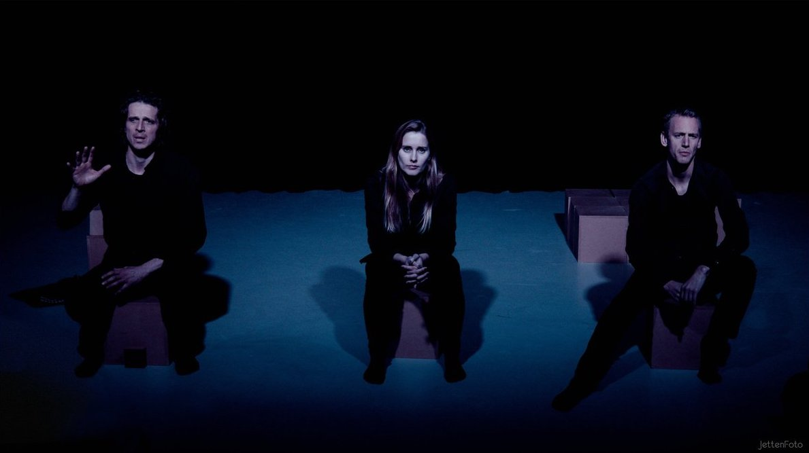

---
categories:
  - blog
date: 10-11-19
description: this is meta description
draft: false
image: images/tf.jpg
pubdate: 2020-1-3
resources: []
tags:
  - thriller
title: Terugblik nederlands thrillerfestival 2019
type: blog
weight: 300

---

Exact een week geleden sloot het Nederlands Thrillerfestival de editie
van dit jaar af met de 13e aflevering van de talkshow "Boek&Meer",
gepresenteerd door Laurens de Groot.

Maar er was nog meer te beleven, want solo speelde hij "De geest van
Seghwaert" en met Funktioneel Naakt speelde hij een double-bill met "De
kus van de roos" en "De verhoren" op één avond. Beide voorstellingen
zijn ook geschreven door Laurens de Groot,

In het fotoalbum van het Nederlands Thrillerfestival kun je nagenieten,
dankzij de foto's van Richard Jetten.

[Fotoalbum De Kus van de Roos](https://nederlandsthrillerfestival.nl/foto-albums/de-kus-van-de-roos)

[Fotoalbum De Geest van Seghwaert](https://nederlandsthrillerfestival.nl/foto-albums/de-geest-van-seghwaert-door-laurens-de-groot)

